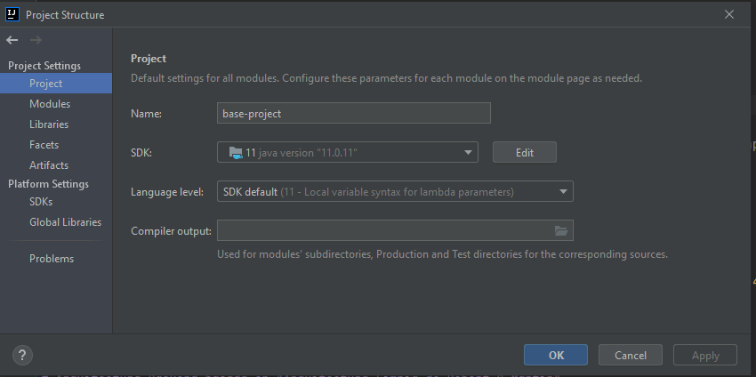
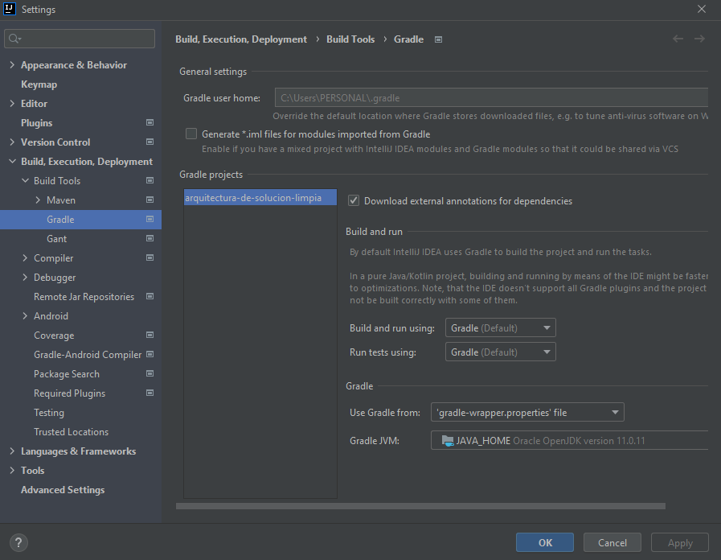
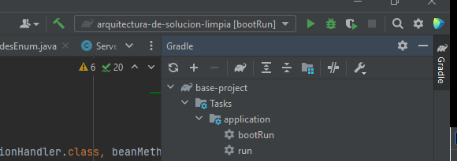
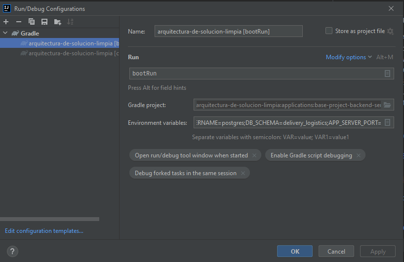
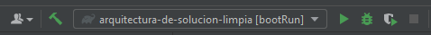
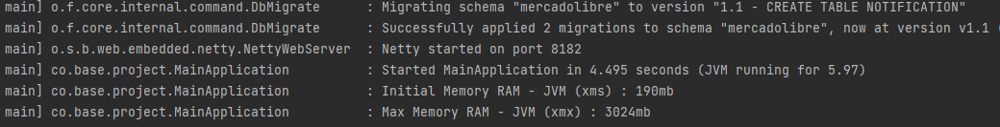
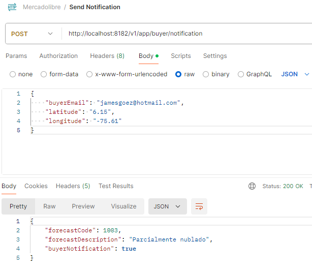
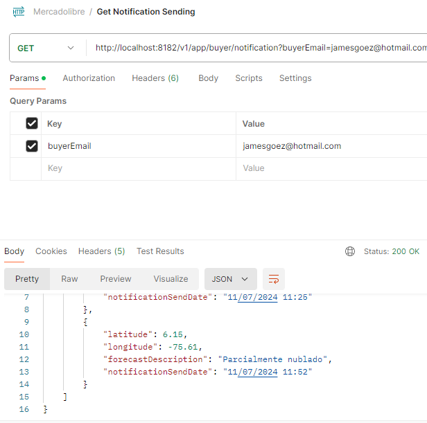
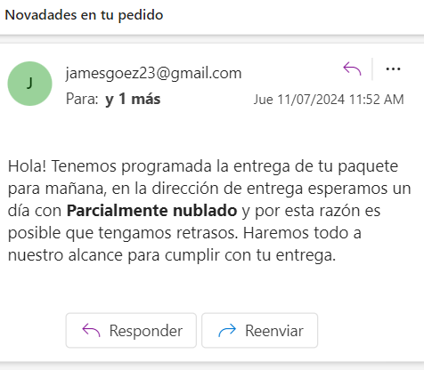

<h1> Challenge Mercadolibre Clean Architecture</h1>

## James Alberto Goez Arismendy
Ingeniero en Sistemas de información - 312 284 3586

## Iniciar el proyecto

### Prerequisitos
1. Intalar postgres en Docker

docker pull postgres:10.6

docker run -p 5432:5432 --name postgres10_6 -e POSTGRES_PASSWORD=postgres -d postgres:10.6

### Variables de entorno - IDE IntelliJ

DB_PROJECT_PASSWORD=postgres;BD_PROJECT_URL=postgresql://localhost:5432/postgres;DB_SCHEMA=mercadolibre;BASE_PATH=/v1/app;PROJECT_NAME=base-project;TABLE=flyway_schema_history;FLYWAY_BASELINE_ON_MIGRATE=true;SPRING_APPLICATION_DEVTOOLS_ADD_PROPERTIES=false;DB_R2DBC_DRIVER_CLASS_NAME=org.postgresql.Driver;APP_SERVER_HOST=localhost;DB_PROJECT_USERNAME=postgres;APP_SERVER_PORT=8182;FLYWAY_ENABLED=true

### Configuración del IDE
Validar el SDK Java 11 o superior

Validar la configuración de Gradle 

Ir al menu Gradle - application - bootRun

Configurar Gradle project arquitectura-de-solucion-limpia\applications\base-project-backend-service
y las Environment variables 

Y listo!, click en Run

### App funcionando

## OpenAPI definition - Swagger
http://localhost:8182/v1/app/webjars/swagger-ui/index.html

## Servicios - Postman

POST http://localhost:8182/v1/app/buyer/notification

Body raw Parameter

{
"buyerEmail": "jamesgoez@hotmail.com",
"latitude": "6.15",
"longitude": "-75.61"
}

GET http://localhost:8182/v1/app/buyer/notification?buyerEmail=jamesgoez@hotmail.com

### Pruebas locales:

A modo de prueba se incluye el código 1003 a la lista de Códigos para envío de correo.

### Documentación de referencia:

- [Clean Architecture](https://medium.com/bancolombia-tech/clean-architecture-aislando-los-detalles-4f9530f35d7a)
- [Scaffolding of Clean Architecture](https://github.com/bancolombia/scaffold-clean-architecture)

https://www.weatherapi.com/api-explorer.aspx

# Arquitectura Backend basada en "Arquitectura Limpia de Robert C Martin"